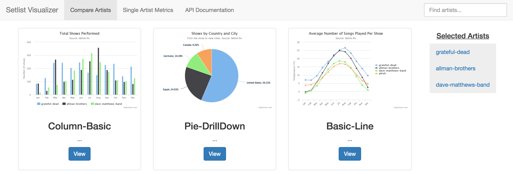

# setlist_visualizer
Visualize Concert Data

----------------------------------------------------------------------------------------------

**Table of Contents**

- [Summary](#summary)
- [Requirements](#requirements)
- [Getting Started](#getting-started)
- [Assumptions](#assumptions)
- [Known Issues](#known-issues)

# Summary
[setlist.fm](http://www.setlist.fm) contains a myriad of concert data for artist all over the world.
The goal of this project is to use their public api to retrieve and visualize concert data using Python and JavaScript. Various correlations will be available via a custom built REST api.

# Requirements
1. Python >= 3.5
2. Docker version 1.11.2
3. Docker Compose version 1.7.1
4. Python dependencies, `pip install -r ~/setlist_visualizer/web/requirements.txt`. Necessary to populate sample artist data. Should really be used in conjunction with [virtualenvwrapper] (http://killtheyak.com/use-virtualenvwrapper/)
5. Edit your hosts file (`/etc/hosts` on OS X/CentOS) to include the below entry. Necessary for hosts to connect to Docker containers:
  - `127.0.0.1       docker.local setlist.visualizer api.setlist.visualizer`

# Getting Started
The project currently supports Docker. There are three containers: Python/Flask, Nginx, and MongoDB.
Everything is currently under construction and liable to change in the future.

#### Start Docker in the foreground
1. cd ~/setlist_visualizer
2. docker-compose build
3. docker-compose up

#### Populate MongoDB with sample artists
1. python get_setlists.py grateful-dead
2. python get_setlists.py allman-brothers
3. python get_setlists.py dave-matthews-band

Open a web browser and navigate to http://setlist.visualizer/.
Something like this should render:

# Assumptions
1. docker-compose.yml is currently configured for OS X. As such MongoDB host directory is /Users/data/db. This can be changed on line 32. Keep in mind that on OS X Docker cannot read from directories outside of /Users.

# Known Issues
1. Currently only tested on Mac OS X 10.10.5 with Chrome Version 50.0.2661.102 (64-bit)
2. Only column-basic chart is fully implemented - other charts are placeholders.
